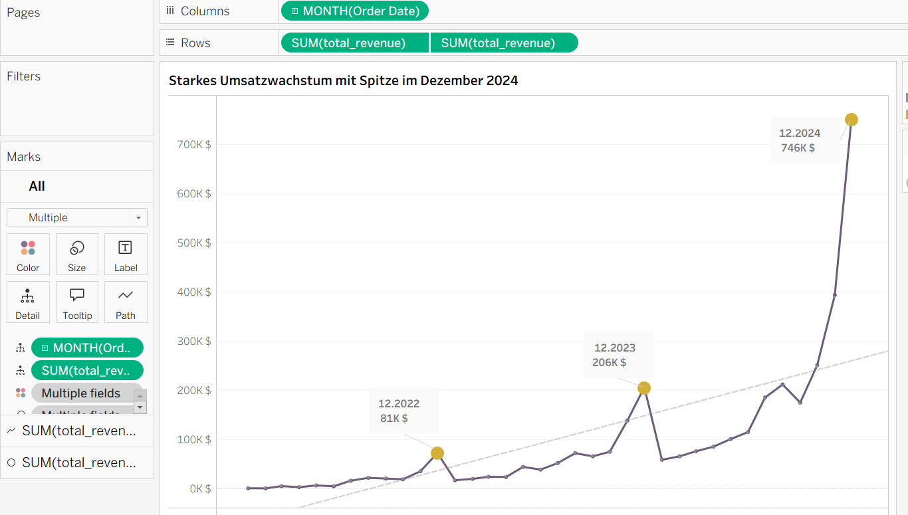
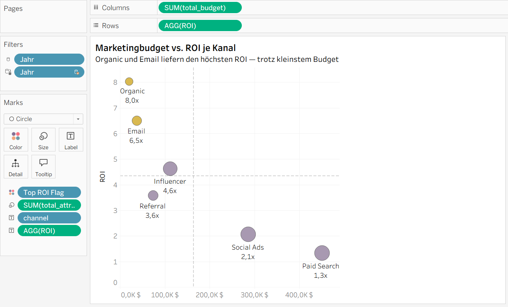
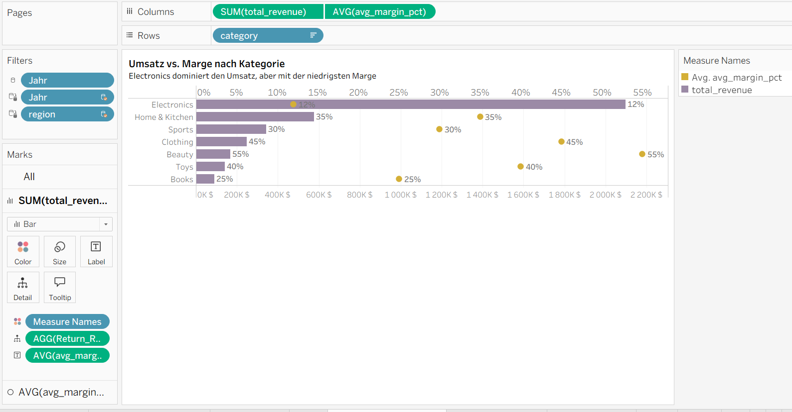
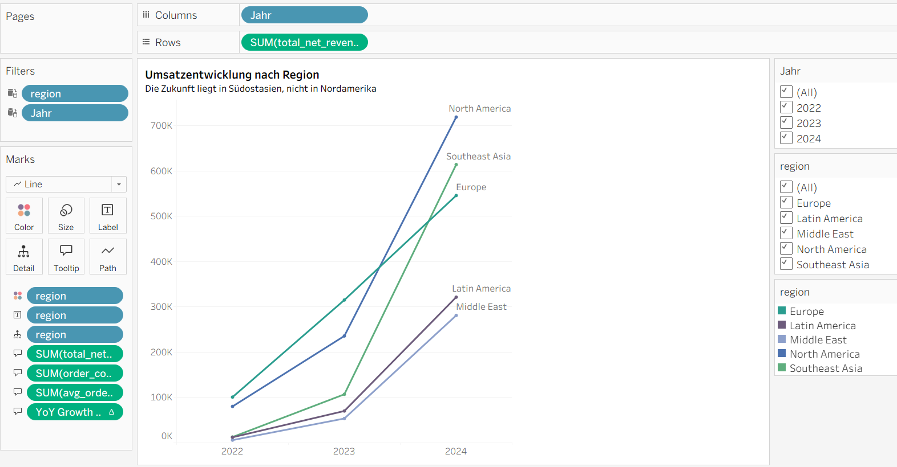

# ShopSphere: Umfassende Geschäftsanalyse eines globalen Online-Marktplatzes

**Finaler Analysebericht**

| | |
|---|---|
| **Projekt** | Umfassende Geschäftsanalyse des globalen Online-Marktplatzes ShopSphere |
| **Datenzeitraum** | 2022–2024 |
| **Rolle** | Datenanalyst |
| **Tools** | SQL (SQLite), Tableau |
| **Abgabeumfang** | dieser Bericht (report.md / report.docx) + Anhang B (SQL-Abfragetexte) + Tableau-Arbeitsmappe (.twbx) mit Dashboards |

---

## Zusammenfassung

Die Analyse der ShopSphere-Daten für den Zeitraum 2022–2024 zeigt ein Unternehmen, das real und stabil wächst — dieses Wachstum ist jedoch höchst ungleich verteilt. Das größte Marketingbudget fließt in den am wenigsten effizienten Kanal (Paid Search), während Kanäle mit dem höchsten langfristigen Kundenwert (Influencer, Referral) nur moderat finanziert werden. Die Kategorie Electronics dominiert den Umsatz, weist jedoch die niedrigste Marge im gesamten Sortiment auf, während die Kategorie Beauty umgekehrt die profitabelste ist. Südostasien wächst fünfmal schneller als Nordamerika, obwohl Letzteres weiterhin der größte Markt nach absolutem Umsatz bleibt. Lediglich 5 % der Kunden erwirtschaften 35 % des gesamten Umsatzes. Kunden, die über systematische Rabatte gewonnen wurden, generieren über die gesamte Kundenbeziehung hinweg dreimal weniger Umsatz als übrige Kunden. Der A/B-Test des neuen Checkouts zeigte eine Gesamtverbesserung von 2 %, dieses Ergebnis wird jedoch fast vollständig von einem kleinen Segment neuer Kunden getragen (+19 %), während der Effekt bei 93 % der Bestellungen (Bestandskunden) statistisch fraglich ist (+0,9 %). Fünf konkrete, zahlenbasierte Handlungsempfehlungen finden sich in Kapitel 10.

**Schlüsselwörter:** Datenanalyse, SQL, Tableau, Dashboard, ROI, ROAS, LTV, Conversion-Funnel, Pareto-Prinzip, A/B-Testing, Simpson-Paradoxon, E-Commerce.

**Tabelle 0.** Wichtigste Kennzahlen des Projekts — Kurzübersicht

| Kennzahl | Wert |
|---|---|
| Gesamtumsatz (2022–2024) | 3.474 Tsd. $ |
| Anzahl Bestellungen | 12.274 |
| Durchschnittlicher Bestellwert | 283 $ |
| Retourenquote | 9,77 % |
| Umsatzanteil der Top-5-%-Kunden | 35,1 % |
| Am schnellsten wachsende Region | Südostasien (+473,9 % YoY) |
| Größtes Budget / niedrigster ROI unter den Kanälen | Paid Search (≈ 451 Tsd. $ / 1,3x) |
| Höchste Marge / niedrigste Marge unter den Kategorien | Beauty (55 %) / Electronics (12 %) |
| Umsatzunterschied: Rabatt-Kunden vs. übrige Kunden | 384 $ vs. 1.261 $ (Faktor 3,3) |
| Effekt des A/B-Tests: Neukunden vs. Bestandskunden | +19,2 % vs. +0,9 % |

---

## Inhaltsverzeichnis

1. Anliegen der CEO und Aufbau des Berichts
2. Verzeichnis der Abkürzungen
3. Einleitung, Projektziel und Datenquellen
4. Kapitel 1. SQL: Datenaufbereitung
5. Kapitel 2. Visualisierungen
6. Kapitel 3. Interaktive Dashboards für die CEO
7. Kapitel 4. Strategische Business Cases
8. Kapitel 5. Statistisches Denken: das A/B-Experiment
9. Grenzen der Analyse
10. Schlussfolgerungen und Handlungsempfehlungen
11. Anhang A: Verzeichnis der einzufügenden Abbildungen (Screenshots)
12. Anhang B: SQL-Abfragetexte
13. Anhang C [RESERVIERT]: Kapitel für das Python-Projekt

---

## 1. Anliegen der CEO und Aufbau des Berichts

In der Strategiesitzung formulierte die CEO ihr Anliegen in eigenen Worten: *"Wir wachsen, aber ich verstehe unser Geschäft nicht vollständig. Wohin fließt das Marketingbudget, und ist es effizient eingesetzt? Wer sind unsere wertvollsten Kunden? Welche Kategorien sind wirklich profitabel, und welche erzeugen nur eine Umsatzillusion? Welche Regionen sind unsere Zukunft? Und ich habe gehört, das Produktteam hat ein Experiment am Checkout durchgeführt — hat es funktioniert oder nicht?"*

Dieser Bericht ist als direkte, konsequente Antwort auf jede dieser Fragen aufgebaut:

**Tabelle 1.** Zuordnung von CEO-Anliegen zu Berichtskapiteln

| Anliegen der CEO | Berichtskapitel |
|---|---|
| Wohin fließt das Marketingbudget, und ist es effizient? | Abschn. 5.2 (ROI) + Case A (Kapitel 7) |
| Wer sind unsere wertvollsten Kunden? | Abschn. 5.5 (Pareto) + Profil der Top-5-%-Kunden (Kapitel 7) |
| Welche Kategorien sind wirklich profitabel, welche erzeugen eine Umsatzillusion? | Abschn. 5.3 + Case B (Kapitel 7) |
| Welche Regionen sind unsere Zukunft? | Abschn. 5.4 (Regionen im Zeitverlauf) |
| Hat das Checkout-Experiment funktioniert? | Kapitel 8 (A/B-Test) |
| *(zusätzlich, über die ursprüngliche Anfrage hinaus)* Sind Rabatte sinnvoll? | Case C (Kapitel 7) |

---

## 2. Verzeichnis der Abkürzungen

| Abkürzung | Bedeutung |
|---|---|
| KPI | Key Performance Indicator — zentrale Leistungskennzahl |
| ROI | Return on Investment — hier: Verhältnis von zugeordnetem Umsatz zu Budget (streng genommen ROAS, siehe Kapitel 4) |
| ROAS | Return on Ad Spend — Umsatz je investiertem Werbedollar |
| LTV | Customer Lifetime Value — Kundenlebenszeitwert |
| CTR | Click-Through Rate — Anteil der Werbeeinblendungen, die zu einem Klick führen |
| YoY | Year-over-Year — Vorjahresvergleich (Wachstumsrate) |
| A/B-Test | Vergleichsexperiment mit zwei Varianten (A — Kontrollgruppe, B — neue Variante) |
| CTE | Common Table Expression — benannte Unterabfrage in SQL (Konstrukt `WITH ... AS (...)`) |
| JOIN | SQL-Operation zur Verknüpfung von Zeilen mehrerer Tabellen über einen Schlüssel |
| NTILE | SQL-Fensterfunktion zur Aufteilung sortierter Zeilen in gleich große Gruppen (Perzentile) |

---

## 3. Einleitung, Projektziel und Datenquellen

Die CEO von ShopSphere wandte sich mit einem klaren Anliegen an das Analyseteam: das Geschäft jenseits oberflächlicher Wachstumszahlen tiefer zu verstehen (siehe Kapitel 1). Um dies fundiert und nicht intuitiv zu beantworten, wurde ein vollständiger Analysezyklus durchgeführt: Datenaufbereitung mittels SQL mit korrekten JOINs und Unterabfragen, Erstellung von mehr als zehn Visualisierungen in Tableau, Zusammenstellung zweier interaktiver Dashboards mit funktionsfähigen Filtern sowie Anwendung statistischen Denkens auf drei Business Cases und ein A/B-Experiment.

**Datenquellen.** Die Analyse umfasst fünf verknüpfte Tabellen für den Zeitraum 2022–2024:

- `shopsphere_customers` — 3.000 Kunden (Region, Land, Alter, Geschlecht, Akquisitionskanal, Registrierungsdatum);
- `shopsphere_products` — 250 Produkte in 7 Kategorien (Preis, Selbstkosten, Marge);
- `shopsphere_orders` — ca. 12.300 Bestellungen (zentrale Faktentabelle);
- `shopsphere_order_items` — ca. 26.000 Bestellpositionen;
- `shopsphere_marketing` — 216 Marketingkampagnen, aufgeschlüsselt nach Kanal × Monat.

Das A/B-Experiment zum Checkout-Design gilt ausschließlich für Bestellungen ab dem 1. Juni 2024 (Feld `ab_variant`).

**Methodisches Prinzip.** Keine Schlussfolgerung in diesem Bericht stützt sich allein auf eine einzelne aggregierte Kennzahl — wo sinnvoll, wurden die Daten in Untergruppen aufgeschlüsselt (nach Jahr, Region, Kanal, Kundentyp), um zu prüfen, ob der Gesamtdurchschnitt eine wichtige Heterogenität verdeckt. Dieses Prinzip zeigt sich besonders deutlich in Kapitel 8.

---

## 4. Kapitel 1. SQL: Datenaufbereitung

In diesem Kapitel wurde eine Reihe von SQL-Abfragen erstellt, die Daten aus mehreren Tabellen über JOINs, Unterabfragen und Fensterfunktionen (`NTILE`) zusammenführen. Jede Abfrage bildet die Grundlage für eine konkrete Visualisierung oder Schlussfolgerung; die Ergebnisse werden daher unmittelbar in den Kapiteln 5 und 7 dargestellt und analysiert, die vollständigen Abfragetexte finden sich in Anhang B.

**1.1. Umsatz, Bestellungen und durchschnittlicher Bestellwert nach Region und Jahr.** JOIN der Tabellen `orders` und `customers` über `customer_id`; Aggregation von Umsatzsumme, Bestellanzahl und gewichtetem durchschnittlichem Bestellwert. Diese Daten bildeten die Grundlage für die Analyse der regionalen Dynamik (Abschn. 5.4) sowie für die KPI-Kacheln des Haupt-Dashboards.

**1.2. Top-10-Kunden nach Ausgaben.** Gruppierung der Bestellungen nach Kunde unter Hinzuziehung von Region und Akquisitionskanal. Bewusster Hinweis zur Analysequalität: Die Berechnung berücksichtigt alle Bestellungen, einschließlich potenziell retournierter.

**1.3. Umsatz, Marge und Retourenquote nach Kategorien.** Vierfacher JOIN (`order_items` → `products` → `orders` → `customers`) zur Verknüpfung von Produktkategorie mit Marge, Region und Retourenstatus. Die Retourenquote wird über die Anzahl retournierter und gesamter eindeutiger Bestellungen separat berechnet (`COUNT(DISTINCT order_id)`), statt über einen fertigen Prozentwert — dies ermöglicht eine korrekte Neuberechnung der Kennzahl unter beliebigen Filtern in Tableau. Die Korrektheit aller JOINs wurde vorab durch eine Kontrollabfrage geprüft (`LEFT JOIN` mit `NULL`-Prüfung), die das Fehlen verwaister Datensätze bestätigte.

**1.4. Kunden mit überdurchschnittlichen Ausgaben.** Zweistufige Berechnung über eine CTE: Ausgabensumme je Kunde, anschließend Vergleich mit dem Datenbankdurchschnitt über eine skalare Unterabfrage. Die exakte Berechnung dieser Konzentration über eine Perzentilverteilung erfolgt separat in Abschn. 5.5 (Pareto-Prinzip).

**1.5. ROI der Marketingkanäle.** Aggregation von Budget und zugeordnetem Umsatz je Kanal. Der ROI wurde als **Verhältnis von Summen** berechnet (`SUM(Umsatz) / SUM(Budget)`), nicht als arithmetisches Mittel einzelner monatlicher ROI-Werte — Letzteres hätte Monaten mit geringem Budget ein unangemessen hohes Gewicht verliehen.

> **Terminologische Klarstellung.** Die in der Aufgabenstellung als "ROI" bezeichnete Kennzahl (Umsatz ÷ Budget) entspricht nach strenger Finanzterminologie dem **ROAS**, da die Selbstkosten der verkauften Produkte nicht berücksichtigt werden. Die Bezeichnung "ROI" wurde beibehalten, um der Formulierung der Aufgabenstellung zu entsprechen — dies ist eine bewusste Vereinfachung, kein Fehler.

---

## 5. Kapitel 2. Visualisierungen

Alle Visualisierungen wurden in Tableau mit einem einheitlichen Farbsystem erstellt. **Regionen** behalten eine eigene, mehrfarbige, kühle Farbpalette (Blau / Türkis / Grün / Violett) — je eine Farbe pro Region —, da im entsprechenden Diagramm (Abschn. 5.4) alle fünf Linien gleichzeitig unterschieden werden müssen. **Alle übrigen Diagramme** (Produktkategorien, Marketingkanäle, ROI, LTV, Conversion-Funnel, Rabattsegmente) verwenden ein einheitliches binäres Akzentfarbpaar **"Gold / Lavendel"**: Gold markiert die Top-1-bis-3-Positionen im jeweiligen Diagramm (eigene Spitzenreiter je Kennzahl), Lavendel den Rest. Dieser Ansatz wurde projektweit einheitlich angewendet, damit dasselbe visuelle Signal ("Gold = Spitzenreiter") auf jedem Diagramm gleich gelesen wird, unabhängig davon, welche Kennzahl es zeigt.

### 5.1. Saisonalität des Umsatzes nach Monat (2022–2024)

Der Umsatz nach Monat zeigt einen klaren Aufwärtstrend mit ausgeprägten Spitzen im Dezember jedes Jahres: Dezember 2022 — 81 Tsd. $, Dezember 2023 — 206 Tsd. $, Dezember 2024 — 746 Tsd. $. Die Form der Linie spricht eher für ein starkes generelles Umsatzwachstum des Unternehmens (besonders ausgeprägt ab 2024) als für ein rein wiederkehrendes, vom Unternehmensmaßstab unabhängiges saisonales Muster — die Schlussfolgerung wurde daher bewusst neutral formuliert ("Wachstum mit Spitze zum Jahresende"), ohne die zu selbstbewusste Aussage einer "klassischen Saisonalität".

*Abbildung 1. Diagramm "Umsatzentwicklung 2022–2024" mit hervorgehobenen Dezember-Spitzen.*


### 5.2. Marketing: Budget vs. Effizienz (ROI)

**Tabelle 2.** ROI, Budget und zugeordneter Umsatz je Marketingkanal

| Kanal | ROI | Budget | Zugeordneter Umsatz |
|---|---|---|---|
| Organic | 8,0x | ≈ 20 Tsd. $ | 163,4 Tsd. $ |
| Email | 6,5x | ≈ 37 Tsd. $ | 243,6 Tsd. $ |
| Influencer | 4,6x | ≈ 112 Tsd. $ | 519,5 Tsd. $ |
| Referral | 3,6x | — | — |
| Social Ads | 2,1x | ≈ 300 Tsd. $ | — |
| **Paid Search** | **1,3x** | **≈ 451 Tsd. $** | 598,7 Tsd. $ |

Die zentrale Erkenntnis ist ein klarer inverser Zusammenhang: Je größer das Budget eines Kanals, desto niedriger sein ROI. Das größte Budget des Unternehmens fließt in den Kanal mit der schlechtesten Rendite (Paid Search), während der effizienteste Kanal (Organic) nur minimal finanziert wird. Ein Vorbehalt, der in Case A vertieft wird: Organic ist technisch kein "bezahlter" Kanal, weshalb sein hoher ROI teilweise durch das praktisch nicht vorhandene Budget erklärt wird — nicht dadurch, dass der Kanal beliebig durch höhere Investitionen skaliert werden könnte.

*Abbildung 2. Streudiagramm "Budget vs. ROI" mit vier Quadranten.*


### 5.3. Kategorien: Umsatzvolumen vs. Profitabilität

**Tabelle 3.** Umsatz, Marge und Retourenquote nach Produktkategorie

| Kategorie | Umsatz | Marge | Retourenquote |
|---|---|---|---|
| Electronics | ≈ 2.098 Tsd. $ (höchster) | **12 % (niedrigste)** | — |
| Home & Kitchen | ≈ 600 Tsd. $ | 35 % | ≈ 10,3 % |
| Clothing | ≈ 200 Tsd. $ | 45 % | — |
| Sports | ≈ 350 Tsd. $ | 30 % | — |
| **Beauty** | ≈ 200 Tsd. $ | **55 % (höchste)** | ≈ 10,0 % |
| Toys | ≈ 150 Tsd. $ | 40 % | — |
| Books | ≈ 100 Tsd. $ (niedrigster) | 25 % | — |

Electronics ist ein Paradebeispiel für die "Umsatzillusion": Die Kategorie erzeugt über viermal so viel Umsatz wie jede andere und wirkt daher bei einem oberflächlichen Blick auf den Verkaufsbericht als wichtigste Kategorie überhaupt — ihre Marge ist jedoch die niedrigste unter allen sieben Kategorien. Am gegenüberliegenden Pol steht Beauty mit der höchsten Marge des Unternehmens (55 %) bei relativ geringem Volumen — der "versteckte Diamant", der in Case B eingehend behandelt wird.

*Abbildung 3. Balkendiagramm der Kategorien "Umsatz vs. Marge nach Kategorie".*



### 5.4. Regionen im Zeitverlauf

**Tabelle 4.** Umsatz und Wachstumsrate nach Region

| Region | Umsatz 2024 | Wachstum YoY (2023→2024) |
|---|---|---|
| Nordamerika | 718,7 Tsd. $ (höchster) | +204,9 % |
| **Südostasien** | 613,9 Tsd. $ | **+473,9 % (am schnellsten)** |
| Europa | 545,6 Tsd. $ | +73,2 % (am langsamsten) |
| Lateinamerika | 321,4 Tsd. $ | +358 % |
| Naher Osten | 281,1 Tsd. $ | +424,9 % |

Die zentrale Erkenntnis ist die Diskrepanz zwischen der "größten" und der "am schnellsten wachsenden" Region: Nordamerika führt als reifer Markt beim absoluten Umsatz, doch gerade Südostasien zeigt ein explosionsartiges Wachstumstempo. Methodischer Hinweis: Die hohen Wachstumsraten (474 %, 425 %, 358 %) erklären sich teilweise durch den Basiseffekt eines niedrigen Ausgangsumsatzes im Jahr 2022 — selbst ein moderater absoluter Zuwachs ergibt dadurch ein hohes prozentuales Ergebnis. Dies schmälert die Bedeutung des Befunds nicht, liefert ihm aber den nötigen Kontext.

*Abbildung 4. Mehrlinien-Diagramm "Umsatzentwicklung nach Region".*



### 5.5. Kundenbeitrag (Pareto-Prinzip)

Die Top-5-%-Kunden des Unternehmens (150 von 3.000 Personen) erwirtschaften **35,1 % des gesamten Nettoumsatzes** (1.218.211 $) — dieses Ergebnis wurde durch zwei unabhängige Berechnungen bestätigt (einfacher Vergleich "Top 5 % vs. Rest" sowie kumulative Pareto-Kurve), die zu einem identischen Ergebnis führten. Die übrigen 95 % der Kunden erwirtschaften 64,9 % des Umsatzes. Dies ist eine mildere Konzentration als die klassische Regel "20 % der Kunden erwirtschaften 80 % des Umsatzes", dennoch bringt jeder Top-5-%-Kunde im Durchschnitt etwa siebenmal mehr ein als ein typischer Kunde. Die Kundenbasis des Unternehmens ist relativ diversifiziert — der Verlust einzelner Kunden stellt kein katastrophales Geschäftsrisiko dar —, dennoch verdient das Top-Segment ein eigenes Bindungsprogramm (Kapitel 7).

*Abbildung 5. Kumulative Pareto-Kurve mit Markierung der 80-%-Schwelle (Platzhalter zum Einfügen).*

### 5.6. Kreativkapitel — Conversion-Funnel nach Akquisitionskanal (CTR und Conversion Rate)

Dieses Kapitel geht bewusst über den bereits untersuchten Bereich der Marketingkampagnen (Abschn. 5.2) hinaus und analysiert eine neue Datendimension — die Effizienz des Klick-Funnels je Kanal: CTR (Anteil der Einblendungen, die zu einem Klick führen) und Conversion Rate (Anteil der Klicks, die zu einem Kauf führen).

**Tabelle 5.** Conversion Rate nach Kanal

| Kanal | Conversion Rate |
|---|---|
| **Organic** | **1,6 % (höchste)** |
| Email | 1,2 % |
| Influencer | 0,9 % |
| Referral | 0,6 % |
| Social Ads | 0,4 % |
| **Paid Search** | **0,2 % (niedrigste)** |

**Diagrammtitel:** "Konversionsrate im Kanalvergleich"
**Untertitel-Erkenntnis:** "Organic und Email konvertieren Klicks am besten — Paid Search verliert die meisten"

Die zentrale Erkenntnis ist der Mechanismus, der den niedrigen ROI von Paid Search und Social Ads erklärt (Abschn. 5.2): Beide Kanäle erzeugen durchaus klickfreudige Werbung, doch der überwiegende Teil der Klicks führt nicht zu einem Kauf — das Geld des Unternehmens "versickert" buchstäblich auf der Etappe "Klick → Kauf". Organic hingegen weist bei relativ niedrigem CTR die höchste Conversion Rate auf — organischer Traffic ist zahlenmäßig geringer, aber im Moment der Kaufentscheidung deutlich qualitativ hochwertiger. Diese Beobachtung ergänzt unmittelbar die Erkenntnisse aus Case A (Kapitel 7).

*Abbildung 6. Balkendiagramm "Konversionsrate im Kanalvergleich" (Platzhalter zum Einfügen).*

---

## 6. Kapitel 3. Interaktive Dashboards für die CEO

### 6.1. Haupt-Dashboard — "Konzentration statt Streuverlust: Die Schlüsselhebel für künftiges Wachstum"

Das Dashboard vereint vier zentrale Visualisierungen aus Kapitel 5, ausgewählt so, dass jede ein konkretes Anliegen der CEO (Kapitel 1) beantwortet: Saisonalität und allgemeine Umsatzdynamik, Regionen als Treiber künftigen Wachstums, Produktkategorien im Verhältnis von Volumen und Profitabilität, sowie Umsatzkonzentration unter den wertvollsten Kunden.

**Pflichtelemente:**
- KPI-Kacheln: Gesamtumsatz — 3.474 Tsd. $, Anzahl Bestellungen — 12.274, durchschnittlicher Bestellwert — 283 $, Retourenquote — 9,77 %;
- zwei funktionsfähige Filter — Jahr und Region, angewendet auf alle Diagramme mit entsprechenden Feldern;
- ein einheitliches Farb- und Schriftsystem.

**Kompositionslogik.** Das Dashboard folgt dem Prinzip eines "Detailtrichters" — von der allgemeinsten zur konkretesten Ebene: Die KPI-Kacheln vermitteln den Gesamtzustand des Geschäfts auf einen Blick; das Regionen-Diagramm bildet den breitesten, geografischen Ausschnitt ("Wo wächst das Geschäft?"); das Kategorien-Diagramm erklärt die Mechanismen der Sortimentseffizienz ("Warum ist das so?"); das Kundenkonzentrations-Diagramm (Pareto) schließt die Erzählung auf der tiefsten, personalisierten Ebene ("Auf wen sollten Entscheidungen gestützt werden?"). Diese Reihenfolge entspricht der Denklogik einer Führungskraft bei Entscheidungen: zunächst der Maßstab, dann die Ursachen, dann die konkreten Menschen.

**Drei Erkenntnisse in den ersten 30 Sekunden:**
1. Südostasien wächst am schnellsten (+474 % YoY), nicht Nordamerika, das lediglich beim absoluten Umsatz führt.
2. Electronics dominiert den Umsatz, weist jedoch die niedrigste Marge unter allen Kategorien auf — die klassische "Umsatzillusion".
3. Nur 5 % der Kunden erwirtschaften 35 % des gesamten Umsatzes.

*Abbildung 7. Vollständige Ansicht des Haupt-Dashboards CEO_Dashboard (Platzhalter zum Einfügen).*

### 6.2. Dashboard für Case A — "Marketingkanäle im Dreifach-Check"

Ein eigenständiges, thematisches Dashboard, das ausschließlich der Verteilung des Marketingbudgets gewidmet ist. Die Entscheidung, es separat auszugliedern, beruht darauf, dass die Analyse hier auf drei unabhängigen Ebenen gleichzeitig erfolgt (Kampagnen-ROI, Kunden-LTV, Conversion-Funnel) — eine eigenständige, tiefere Erzählung, die einen eigenen, fokussierten Raum verdient.

**Untertitel des Dashboards:** *"Organic und Email liefern den höchsten ROI und die beste Conversion, Influencer und Referral bauen die treuesten und wertvollsten Kundenbeziehungen auf — nur Paid Search versagt auf allen drei Ebenen."*

**Gestalterische Entscheidung.** Die ursprünglichen Versionen der LTV- und Conversion-Rate-Diagramme wurden als Streudiagramme erstellt, doch die Anordnung dreier Streudiagramme nebeneinander erzeugte visuelle Monotonie. Daher wurden die LTV- und Conversion-Rate-Diagramme bewusst in **Balkendiagramme** umgewandelt, während das Streudiagramm-Format nur für Budget vs. ROI beibehalten wurde (technisch gerechtfertigt, da es drei Dimensionen gleichzeitig zeigt: Budget, ROI, absoluten Umsatz über die Punktgröße). Für alle drei Diagramme wurde dasselbe Akzentfarbpaar "Gold / Lavendel" verwendet wie im übrigen Projekt (siehe Kapitel 5): Gold markiert die Top-2-Kanäle in jedem einzelnen Diagramm, sodass sich "Wer ist Spitzenreiter?" mit demselben visuellen Signal auf allen drei Diagrammen ablesen lässt.

*Abbildung 8. Vollständige Ansicht des Dashboards Case_A_Marketing (ROI-Streudiagramm + LTV-Balken + Conversion-Balken) (Platzhalter zum Einfügen).*

---

## 7. Kapitel 4. Strategische Business Cases

### 7.1. Case A. Wohin sollte das Marketingbudget fließen?

Den höchsten ROI unter allen sechs Kanälen zeigt Organic (8,0x), wobei das Budget dieses Kanals minimal ist (≈ 20 Tsd. $), da organischer Traffic kein klassisch bezahlter Kanal ist — sein hoher ROI ist teilweise "künstlich" und lässt sich nicht durch eine direkte Budgeterhöhung skalieren. Den niedrigsten ROI zeigt Paid Search (1,3x) — und genau dorthin fließt der größte Anteil des Unternehmensbudgets (≈ 451 Tsd. $). Dies ist eine unkluge Ressourcenverteilung: Das Budget-vs.-ROI-Diagramm zeigt einen klaren inversen Zusammenhang.

**Tabelle 6.** Kanalvergleich nach ROI und langfristigem Kundenwert (LTV)

| Kanal | ROI | Rang nach ROI | LTV je Kunde | Rang nach LTV | Bestellungen je Kunde |
|---|---|---|---|---|---|
| Organic | 8,0x | 1 | 1.316 $ | 3 | 4,7 |
| Email | 6,5x | 2 | 1.074 $ | 4 | 4,0 |
| **Influencer** | 4,6x | 3 | **1.986 $** | **1** | 6,6 |
| **Referral** | 3,6x | 4 | **1.792 $** | **2** | ≈ 6,0 |
| Social Ads | 2,1x | 5 | 822 $ | 5 | 3,0 |
| **Paid Search** | 1,3x | **6** | **≈ 600 $** | **6** | 2,3 |

Der Vergleich mit dem LTV offenbart eine Diskrepanz, die nicht mit dem ROI-Ranking übereinstimmt. Influencer und Referral belegen beim ROI nur mittlere Positionen (Rang 3 und 4), bilden jedoch den höchsten Kundenlebenszeitwert — ihre Kunden tätigen fast dreimal so viele Folgebestellungen wie Paid-Search-Kunden (6,6–6,0 gegenüber 2,3). Letzterer ist der einzige Kanal, der bei beiden Kennzahlen gleichzeitig als Schlusslicht abschneidet — und wie die Conversion-Funnel-Analyse zeigt (Abschn. 5.6), liegt die Ursache systemisch begründet vor: Nur 0,2 % der Klicks dieses Kanals führen zu einem Kauf, der schlechteste Wert unter allen sechs Kanälen.

*Abbildung 9. Streudiagramm LTV vs. Bestellanzahl je Kunde nach Kanal (LTV_Kanal_Scatter) — veranschaulicht einen nahezu linearen Zusammenhang zwischen Wiederkaufhäufigkeit und Kundenlebenszeitwert (Platzhalter zum Einfügen).*

*Abbildung 10. Balkendiagramm zur Rangfolge der Kanäle nach LTV (Platzhalter zum Einfügen).*

**Begründete Handlungsempfehlung.** Das Budget von Paid Search um etwa 30–40 % kürzen, da dieser Kanal auf der Ebene von ROI, LTV und Conversion-Mechanik gleichermaßen ineffizient ist — das Fehlerrisiko dieser Schlussfolgerung ist minimal, da sie durch drei unabhängige Messmethoden bestätigt wird. Die freiwerdenden Mittel sollten in Influencer und Referral umgeschichtet werden. Das Email-Budget beibehalten oder leicht erhöhen; Organic indirekt über SEO und Content-Strategie unterstützen; Social Ads als zweitgrößten Budgetposten mit schwachen Werten auf allen Ebenen kritisch überprüfen.

**Risiken der Handlungsempfehlung.** Erstens eine mögliche First-Touch-Attribution — Paid Search könnte neue Kunden anziehen, die später über andere Kanäle konvertieren; eine drastische Kürzung riskiert, den gesamten Akquisitions-Funnel zu schwächen. Zweitens verfügen Influencer und Referral über eine begrenzte Skalierbarkeit — die besten Partnerschaften sind vermutlich bereits ausgeschöpft. Drittens wurde der LTV ohne Kontrolle für das "Alter" der Kundenkohorte berechnet. Viertens könnte eine Budgetkürzung während der Hochsaison (viertes Quartal) einen unverhältnismäßig negativen Effekt haben.

Alle drei Analyseebenen dieses Cases — ROI (Tabelle 2, Abschn. 5.2), LTV (Tabelle 6) und Conversion-Funnel (Tabelle 5, Abschn. 5.6) — werden gemeinsam im separaten Dashboard Case_A_Marketing (Abbildung 8, Abschn. 6.2) zusammengeführt, das als visuelle Zusammenfassung für die Präsentation dieses Cases vor der Geschäftsführung dient.

### 7.2. Case B. Welche Kategorien sind wirklich profitabel?

Electronics ist ein Paradebeispiel für die "Umsatzillusion" (siehe Tabelle 3 und Abbildung 3, Abschn. 5.3): Die Kategorie erzeugt den höchsten Umsatz des Unternehmens (≈ 2.098 Tsd. $, viermal so viel wie die nächstgrößere Kategorie), ihre Marge ist jedoch die niedrigste unter allen sieben Kategorien (12 %). Das Unternehmen "erwirtschaftet Volumen", nicht Geld — bei einer Ausrichtung ausschließlich am Umsatzvolumen erhält diese Kategorie unverhältnismäßig viel Aufmerksamkeit, Regalfläche und Marketingbudget im Verhältnis zum tatsächlichen Gewinn.

Der gegenteilige, "versteckte Diamant" ist die Kategorie Beauty mit der höchsten Marge des Unternehmens (55 %) bei relativ bescheidenem Umsatzvolumen (≈ 200 Tsd. $) und niedriger Retourenquote (≈ 10 %). Ein ähnliches, wenn auch weniger ausgeprägtes Muster zeigen Clothing (45 %) und Toys (40 %).

**Handlungsempfehlung.** Die Marketinginvestitionen gezielt in Beauty erhöhen, da hier jeder zusätzliche Umsatzdollar deutlich wertvoller ist als bei Electronics; die Sortimentspräsenz im Katalog und in den Website-Empfehlungen überprüfen; Cross-Selling mit anderen Kategorien in Betracht ziehen; die vorhandene Produktqualität (niedrige Retourenquote) bei der Skalierung beibehalten.

> **Methodische Einschränkung.** Die verwendete Marge ist ein einfacher Kategoriedurchschnitt (`AVG`), nicht gewichtet nach dem tatsächlichen Verkaufsvolumen je Produkt. Für eine endgültige Investitionsentscheidung sollte zusätzlich geprüft werden, ob ein oder zwei hochpreisige Produkte den Durchschnitt nach oben "ziehen".

### 7.3. Case C. Rabatte und wertvolle Kunden

**Tabelle 7.** Rabatt-Kunden (> 20 %) im Vergleich zur übrigen Kundenbasis

| Kennzahl | Discount-Kunden (> 20 %) | Übrige Kunden |
|---|---|---|
| Anzahl Kunden | 352 | 2.648 |
| Bestellungen je Kunde | **2,17** | **4,35** |
| Einmalkäufer | 88 (25 %) | 439 (16,6 %) |
| Durchschnittliche Gesamtausgaben | **384 $** | **1.261 $** |

Der Vergleich von Kunden, die überwiegend mit einem Rabatt von über 20 % kaufen (352 Personen), mit der übrigen Kundenbasis (2.648 Personen) liefert ein eindeutiges Ergebnis: Rabatt-Kunden tätigen halb so viele Bestellungen, ein Viertel von ihnen (25 %) wird zu Einmalkäufern (gegenüber 16,6 % bei regulären Kunden), und über die gesamte Kundenbeziehung hinweg erwirtschaften sie dreimal weniger Umsatz (384 $ gegenüber 1.261 $).

**Handlungsempfehlung.** Tiefe und Häufigkeit von Rabatten speziell für Neukunden begrenzen; Rabatte vorrangig als Instrument zur Reaktivierung und Bindung bereits loyaler Kunden einsetzen, nicht als primären Akquisitionskanal — da über Rabatte gewonnene Kunden von allen im Projekt untersuchten Segmenten die schwächste Bindungsökonomie aufweisen.

*Abbildung 11. Dual-Achsen-Diagramm "Rabatt-Kunden bestellen seltener und geben weniger aus" (Platzhalter zum Einfügen).*

### 7.4. Profil der Top-5-%-Kunden: Wer sie sind und wie sie gebunden werden können

**Tabelle 8.** Top-5-Kombinationen "Region × Kanal" nach Umsatz unter den Top-5-%-Kunden

| Region | Kanal | Umsatz | Anteil am Umsatz der Top-5-% |
|---|---|---|---|
| Europa | Influencer | 125,9 Tsd. $ | 10 % |
| Südostasien | Organic | 117,1 Tsd. $ | 10 % |
| Südostasien | Influencer | 105,0 Tsd. $ | 9 % |
| Nordamerika | Influencer | 95,3 Tsd. $ | 8 % |
| Nordamerika | Organic | 89,3 Tsd. $ | 7 % |

Die Profilierung der 150 Kunden, die die Top-5-% der Basis bilden und 35,1 % des Unternehmensumsatzes erwirtschaften (1.218.211 $), nach Region und Akquisitionskanal zeigt eine deutliche Konzentration: Die fünf stärksten Kombinationen erwirtschaften zusammen fast 44 % des gesamten Umsatzes des Top-5-%-Segments.

Nach Region konzentrieren sich die wertvollsten Kunden auf Europa und Nordamerika (je 42 Kunden, zusammen 56 % des Top-Segments), Südostasien belegt Platz drei (38 Kunden, 25 %) — besonders relevant, da diese Region zugleich am schnellsten wächst (Abschn. 5.4), was ein doppeltes Signal für prioritäre Investitionen darstellt. Nach Akquisitionskanal dominieren Influencer und Organic (zusammen ≈ 60 % aller wertvollsten Kunden), während Paid Search und Social Ads im Top-Segment praktisch nicht vertreten sind.

**Bindungsempfehlungen:** ein personalisiertes VIP-Programm für die Kombinationen Europa/Influencer und Südostasien/Organic; Skalierung von Influencer-Partnerschaften gezielt in Europa und Südostasien; zusätzliche Investitionen in organisches Wachstum (SEO, Content) für Südostasien; prioritärer Kundensupport für das gesamte Top-Segment; bewusster Verzicht auf Bindungsausgaben über Paid Search und Social Ads.

*Abbildung 12. Heatmap "Kundenkonzentration nach Region und Kanal" (Platzhalter zum Einfügen).*

---

## 8. Kapitel 5. Statistisches Denken: das A/B-Experiment

Das Produktteam testete ab dem 1. Juni 2024 ein neues Checkout-Design: Die Hälfte der Bestellungen erhielt die alte Version (Variante A), die andere Hälfte die neue (Variante B). Die Aufgabe des Analysten besteht nicht darin, lediglich Durchschnittswerte zu vergleichen, sondern zu prüfen, ob eine Gesamtzahl eine wichtige Heterogenität verdeckt.

**Erster, oberflächlicher Blick.** Der Vergleich des durchschnittlichen Bestellwerts über alle Bestellungen des Experiments: Variante A — 281,73 $ (3.681 Bestellungen), Variante B — 287,27 $ (3.674 Bestellungen), eine Differenz von +1,97 % zugunsten der neuen Version. Die Bestellanzahl ist in beiden Gruppen nahezu identisch, was eine korrekte, ausgewogene Traffic-Aufteilung bestätigt. Auf dieser Ebene drängt sich der Schluss auf: Der neue Checkout funktioniert besser und sollte für alle eingeführt werden.

**Tabelle 9.** Durchschnittlicher Bestellwert nach 4 Untergruppen (Neu-/Bestandskunden × Variante A/B)

| Gruppe | Anzahl Bestellungen | Durchschnittlicher Bestellwert |
|---|---|---|
| A — Neukunden | 264 | 223,30 $ |
| B — Neukunden | 256 | **266,21 $ (+19,2 %)** |
| A — Bestandskunden | 3.417 | 286,24 $ |
| B — Bestandskunden | 3.418 | **288,85 $ (+0,9 %)** |

**Tiefergehende Analyse.** Teilt man jede Gruppe in Neukunden (erste Bestellung innerhalb von ≈ 60 Tagen nach der Registrierung) und Bestandskunden auf, ändert sich das Bild erheblich. Bei Neukunden stieg der durchschnittliche Bestellwert um 19,2 % — ein starker, praktisch relevanter Effekt. Bei Bestandskunden, die 93 % der Bestellungen des Experiments ausmachen (6.835 von 7.355), beträgt der Anstieg lediglich 0,9 % — so gering, dass eine gesonderte Prüfung der statistischen Signifikanz erforderlich ist.

> **Methodischer Hinweis zur Definition eines "Neukunden".** Hat sich ein Kunde bereits vor längerer Zeit registriert, aber erst jetzt — mehr als 60 Tage nach der Registrierung — zum ersten Mal gekauft, wird diese Bestellung als "Bestandskunde" klassifiziert, obwohl es technisch seine erste Bestellung ist. Dies ist eine bewusste Interpretation der Aufgabenstellung, kein Berechnungsfehler.

Wichtig ist folgende methodische Feinheit: Es handelt sich hier nicht um das klassische Simpson-Paradoxon in seiner schärfsten Form, da sich die Wirkungsrichtung nicht umkehrt — Variante B verbessert den durchschnittlichen Bestellwert in beiden Untergruppen. Es handelt sich vielmehr um eine **Effekt-Heterogenität**: Der Gesamtanstieg von 2 % setzt sich aus einer enormen Verbesserung für eine kleine Gruppe von Neukunden (7 % der Bestellungen) und einem nahezu null Effekt für die überwiegende Mehrheit der Bestellungen zusammen.

**Für wen sich die neue Version einzuführen lohnt.** Der neue Checkout sollte mit Zuversicht für Neukunden eingeführt werden, wo der Effekt stark ausgeprägt ist. Für Bestandskunden ist eine Prüfung der statistischen Signifikanz erforderlich (z. B. ein t-Test), da bei einer Stichprobe von über 3.400 Bestellungen selbst ein geringer Unterschied statistisch signifikant, aus praktischer Sicht jedoch fraglich sein kann.

**Ehrlichkeit bei der Ergebnisdarstellung.** Wollte man Variante B um jeden Preis "verkaufen", würde man ausschließlich das Segment der Neukunden zeigen und einen Anstieg von 19 % verkünden — verschweigend, dass dies nur 7 % der Bestellungen betrifft. Wollte man das Ergebnis hingegen "begraben", würde man nur die Bestandskunden zeigen (+0,9 %, statistisch unbedeutendes Rauschen) und den realen Nutzen für Neukunden ignorieren. Ein ehrlicher Analyst zeigt beide Datenebenen gleichzeitig und formuliert zwei getrennte Handlungsempfehlungen für die zwei Segmente.

**Zentrale methodische Lehre:** Eine einzelne aggregierte Zahl erzählt niemals die gesamte Geschichte, und die wichtigste Fähigkeit eines Analysten besteht darin, zu erkennen, wann einem Durchschnittswert ohne weitere Detaillierung nicht vertraut werden darf.

*Abbildung 13. Balkendiagramm zum Vergleich Variante A vs. B insgesamt (erstellt, Platzhalter zum Einfügen).*
*Abbildung 14. Balkendiagramm der 4 Untergruppen Neu-/Bestandskunden × A/B — zum Zeitpunkt der Berichterstellung noch nicht fertiggestellt: Bei der Arbeit in Tableau trat eine technische Schwierigkeit bei der korrekten Gruppierung von vier Balken auf einer Achse auf, die Arbeit daran wurde vorübergehend ausgesetzt (Platzhalter zum Einfügen nach Fertigstellung).*

---

## 9. Grenzen der Analyse

Dieses Kapitel bündelt die wichtigsten methodischen Vorbehalte, die in den vorangegangenen Kapiteln verstreut angesprochen wurden:

- **Marketing-Attribution.** ROI der Kampagnen und Kunden-LTV berücksichtigen keinen First-Touch-Attributionseffekt.
- **Basiseffekt bei den Regionen.** Die hohen Wachstumsraten (Südostasien, Naher Osten, Lateinamerika) erklären sich teilweise durch das geringe Ausgangsumsatzvolumen im Jahr 2022.
- **Ungewichtete Kategoriemarge.** Die Kennzahl ist ein einfacher Durchschnitt (`AVG`), nicht gewichtet nach dem Verkaufsvolumen je Produkt.
- **LTV ohne Kontrolle für das Kohorten-"Alter".** Eine längere Kundenbeziehungsdauer erhöht den kumulierten LTV unabhängig von der tatsächlichen Loyalität.
- **Definition des "Neukunden" im A/B-Test.** Ein Kunde, der sich bereits vor längerer Zeit registriert, aber erst nach mehr als 60 Tagen zum ersten Mal gekauft hat, wird als "Bestandskunde" eingestuft.
- **Begrenzte Skalierbarkeit einzelner Kanäle.** Organic lässt sich nicht direkt über ein Budget skalieren; Influencer und Referral verfügen möglicherweise über eine begrenzte Kapazität an erstklassigen Partnerschaften.
- **Globales Ranking in der Pareto-Analyse.** Die Top-5-%-Kunden (Abschn. 5.5, 7.4) wurden einmalig über die gesamte Datenbasis hinweg bestimmt, ohne separate Neuberechnung je Region. Bei Anwendung des Regionsfilters auf die kumulative Pareto-Kurve (Abbildung 5) zeigt das Diagramm daher die Verteilung des bereits festgelegten globalen Top-Segments über die Regionen — nicht eine eigenständige Neuberechnung von "Wer ist Top 5 % genau in dieser Region?" —, und in Regionen mit wenigen globalen Top-Kunden kann die Kurve ungleichmäßig wirken. Dies ist eine bewusste methodische Entscheidung, kein Berechnungsfehler.

---

## 10. Schlussfolgerungen und Handlungsempfehlungen

1. **Marketingbudget umverteilen:** Paid Search um 30–40 % kürzen, freiwerdende Mittel in Influencer und Referral investieren.
2. **Positionierung von Electronics überdenken:** Die Kategorie erzeugt bei niedrigster Marge eine Umsatzillusion; Investitionen in Beauty, Clothing und Toys erhöhen.
3. **Prioritär in Südostasien investieren:** die am schnellsten wachsende Region, die bereits zu den drei Regionen mit der höchsten Konzentration wertvollster Kunden zählt.
4. **Systematische Rabatte für Neukunden begrenzen:** Rabatte vorrangig als Instrument zur Bindung bereits loyaler Kunden einsetzen.
5. **Neuen Checkout (Variante B) selektiv einführen:** mit Zuversicht für Neukunden; für die Bestandskundenbasis eine zusätzliche Prüfung der statistischen Signifikanz durchführen.

**Gesamtfazit.** Das Wachstum von ShopSphere ist real und zahlenbasiert bestätigt, jedoch höchst ungleich verteilt zwischen Marketingkanälen, Produktkategorien, geografischen Regionen und Kundensegmenten. Die zentrale strategische Aufgabe des Unternehmens für das kommende Jahr besteht nicht darin, einfach "insgesamt schneller zu wachsen", sondern die begrenzten Ressourcen gezielt dorthin zu lenken, wo die Rendite am höchsten ist, und gleichzeitig Investitionen dort bewusst zu reduzieren, wo sie derzeit ineffizient eingesetzt werden.

---

## 11. Anhang A: Verzeichnis der einzufügenden Abbildungen (Screenshots)

| Nr. | Abbildung | Kapitel | Was einzufügen ist |
|---|---|---|---|
| 1 | Abb. 1 | 5.1 | Saisonalitätsdiagramm mit hervorgehobenen Dezember-Spitzen |
| 2 | Abb. 2 | 5.2 | Streudiagramm "Budget vs. ROI" |
| 3 | Abb. 3 | 5.3 | Balkendiagramm der Kategorien "Umsatz vs. Marge" |
| 4 | Abb. 4 | 5.4 | Mehrlinien-Diagramm der Regionen |
| 5 | Abb. 5 | 5.5 | Kumulative Pareto-Kurve |
| 6 | Abb. 6 | 5.6 | Balkendiagramm "Konversionsrate im Kanalvergleich" |
| 7 | Abb. 7 | 6.1 | Vollständige Ansicht des Haupt-Dashboards CEO_Dashboard |
| 8 | Abb. 8 | 6.2 | Vollständige Ansicht des Dashboards Case_A_Marketing |
| 9 | Abb. 9 | 7.1 | Streudiagramm LTV vs. Bestellanzahl |
| 10 | Abb. 10 | 7.1 | Balkendiagramm LTV nach Kanal (Rangfolge) |
| 11 | Abb. 11 | 7.3 | Dual-Achsen-Diagramm "Rabatt-Kunden bestellen seltener" |
| 12 | Abb. 12 | 7.4 | Heatmap der Kundenkonzentration nach Region und Kanal |
| 13 | Abb. 13 | 8 | Balkendiagramm Variante A vs. B (gesamt) |
| 14 | Abb. 14 | 8 | Balkendiagramm der 4 Untergruppen (Neu-/Bestandskunden × A/B) |

---

## 12. Anhang B: SQL-Abfragetexte

```sql
-- 1.1. Umsatz, Bestellungen und durchschnittlicher Bestellwert nach Region und Jahr
SELECT
    c.region                                   AS region,
    o.order_year                               AS order_year,
    SUM(o.net_amount)                          AS total_net_revenue,
    COUNT(o.order_id)                          AS order_count,
    ROUND(SUM(o.net_amount) * 1.0 / COUNT(o.order_id), 2) AS avg_order_value
FROM shopsphere_orders AS o
JOIN shopsphere_customers AS c ON o.customer_id = c.customer_id
GROUP BY c.region, o.order_year
ORDER BY c.region, o.order_year;

-- 1.2. Top-10-Kunden nach Gesamtausgaben
SELECT
    c.customer_id                      AS customer_id,
    c.region                           AS region,
    c.acquisition_channel              AS acquisition_channel,
    COUNT(o.order_id)                  AS order_count,
    SUM(o.net_amount)                  AS total_spent
FROM shopsphere_orders AS o
JOIN shopsphere_customers AS c ON o.customer_id = c.customer_id
GROUP BY c.customer_id, c.region, c.acquisition_channel
ORDER BY total_spent DESC
LIMIT 10;

-- 1.3. Umsatz, Marge und Retourenquote nach Kategorien (mit Region und Jahr)
SELECT
    p.category                                                           AS category,
    o.order_year                                                         AS order_year,
    c.region                                                             AS region,
    SUM(oi.line_total)                                                   AS total_revenue,
    ROUND(AVG(p.margin_pct), 2)                                          AS avg_margin_pct,
    COUNT(DISTINCT CASE WHEN o.is_returned = 1 THEN oi.order_id END)     AS returned_orders,
    COUNT(DISTINCT oi.order_id)                                          AS total_orders
FROM shopsphere_order_items AS oi
JOIN shopsphere_products AS p ON oi.product_id = p.product_id
JOIN shopsphere_orders AS o ON oi.order_id = o.order_id
JOIN shopsphere_customers AS c ON o.customer_id = c.customer_id
GROUP BY p.category, o.order_year, c.region
ORDER BY p.category, o.order_year, c.region;

-- 1.4. Kunden mit überdurchschnittlichen Ausgaben (CTE)
WITH customer_totals AS (
    SELECT customer_id, SUM(net_amount) AS customer_total
    FROM shopsphere_orders
    GROUP BY customer_id
)
SELECT
    COUNT(*)                                                  AS customers_above_avg,
    SUM(customer_total)                                       AS revenue_above_avg,
    ROUND(SUM(customer_total) * 1.0 / (SELECT SUM(net_amount) FROM shopsphere_orders), 4) AS share_of_total_revenue
FROM customer_totals
WHERE customer_total > (SELECT AVG(customer_total) FROM customer_totals);

-- 1.5. ROI der Marketingkanäle
SELECT
    channel                                                  AS channel,
    SUM(budget)                                              AS total_budget,
    SUM(attributed_revenue)                                  AS total_attributed_revenue,
    ROUND(SUM(attributed_revenue) * 1.0 / SUM(budget), 2)    AS roi
FROM shopsphere_marketing
GROUP BY channel
ORDER BY roi DESC;

-- 2.5 (Abschn. 5.5). Pareto: Umsatzverteilung der Top-5-%-Kunden in 20 Perzentilgruppen (mit Region)
WITH customer_totals AS (
    SELECT
        o.customer_id                    AS customer_id,
        c.region                         AS region,
        SUM(o.net_amount)                AS total_spent
    FROM shopsphere_orders AS o
    JOIN shopsphere_customers AS c ON o.customer_id = c.customer_id
    GROUP BY o.customer_id, c.region
),
ranked AS (
    SELECT
        customer_id, region, total_spent,
        NTILE(20) OVER (ORDER BY total_spent DESC) AS percentile_bucket
    FROM customer_totals
)
SELECT
    percentile_bucket                          AS percentile_bucket,
    region                                      AS region,
    COUNT(*)                                    AS customers_in_bucket,
    SUM(total_spent)                            AS bucket_revenue
FROM ranked
GROUP BY percentile_bucket, region
ORDER BY percentile_bucket, region;

-- 2.6 (Abschn. 7.1). LTV nach Akquisitionskanal des Kunden
SELECT
    c.acquisition_channel                                      AS acquisition_channel,
    COUNT(DISTINCT c.customer_id)                              AS customer_count,
    SUM(o.net_amount)                                          AS total_revenue,
    ROUND(SUM(o.net_amount) * 1.0 / COUNT(DISTINCT c.customer_id), 2)  AS avg_ltv_per_customer,
    ROUND(COUNT(o.order_id) * 1.0 / COUNT(DISTINCT c.customer_id), 2)  AS avg_orders_per_customer
FROM shopsphere_customers AS c
JOIN shopsphere_orders AS o ON c.customer_id = o.customer_id
GROUP BY c.acquisition_channel
ORDER BY avg_ltv_per_customer DESC;

-- 2.6 (Abschn. 5.6). Conversion-Funnel nach Kanal (CTR und Conversion Rate)
SELECT
    channel                                                    AS channel,
    SUM(impressions)                                           AS total_impressions,
    SUM(clicks)                                                AS total_clicks,
    SUM(conversions)                                           AS total_conversions,
    ROUND(SUM(clicks) * 100.0 / SUM(impressions), 2)           AS ctr_pct,
    ROUND(SUM(conversions) * 100.0 / SUM(clicks), 2)           AS conversion_rate_pct
FROM shopsphere_marketing
GROUP BY channel
ORDER BY conversion_rate_pct DESC;

-- Case C (Abschn. 7.3). Rabatt-Kunden (>20%) vs. übrige Kunden
WITH customer_discount AS (
    SELECT
        customer_id,
        AVG(discount_pct)                          AS avg_discount,
        COUNT(order_id)                             AS order_count,
        SUM(net_amount)                              AS total_spent
    FROM shopsphere_orders
    GROUP BY customer_id
)
SELECT
    CASE WHEN avg_discount > 20 THEN 'Discount-Kunden (>20%)' ELSE 'Übrige Kunden' END AS segment,
    COUNT(*)                                          AS customer_count,
    ROUND(AVG(order_count), 2)                        AS avg_orders_per_customer,
    SUM(CASE WHEN order_count = 1 THEN 1 ELSE 0 END)  AS one_time_buyers,
    ROUND(SUM(CASE WHEN order_count = 1 THEN 1 ELSE 0 END) * 100.0 / COUNT(*), 1) AS pct_one_time_buyers,
    ROUND(AVG(total_spent), 2)                        AS avg_total_spent
FROM customer_discount
GROUP BY segment;

-- Abschn. 7.4. Profil der Top-5-%-Kunden nach Region und Kanal (nach Umsatz)
WITH customer_totals AS (
    SELECT customer_id, SUM(net_amount) AS total_spent
    FROM shopsphere_orders
    GROUP BY customer_id
),
ranked AS (
    SELECT customer_id, total_spent,
        NTILE(20) OVER (ORDER BY total_spent DESC) AS percentile_bucket
    FROM customer_totals
),
top5 AS (
    SELECT customer_id, total_spent
    FROM ranked
    WHERE percentile_bucket = 1
)
SELECT
    c.region                                   AS region,
    c.acquisition_channel                       AS acquisition_channel,
    COUNT(*)                                    AS top_customer_count,
    SUM(top5.total_spent)                       AS revenue_from_top5,
    ROUND(SUM(top5.total_spent) * 100.0 / (SELECT SUM(total_spent) FROM top5), 1) AS pct_of_top5_revenue
FROM top5
JOIN shopsphere_customers AS c ON top5.customer_id = c.customer_id
GROUP BY c.region, c.acquisition_channel
ORDER BY revenue_from_top5 DESC;

-- Kapitel 5 (Abschn. 8). A/B-Test: Gesamtvergleich Variante A vs. B
SELECT
    ab_variant                                 AS ab_variant,
    COUNT(*)                                    AS order_count,
    ROUND(AVG(net_amount), 2)                   AS avg_net_amount
FROM shopsphere_orders
WHERE ab_variant IN ('A', 'B')
GROUP BY ab_variant
ORDER BY ab_variant;

-- Kapitel 5 (Abschn. 8). A/B-Test: Aufteilung in Neu- und Bestandskunden (4 Untergruppen)
WITH customer_first_order AS (
    SELECT customer_id, MIN(order_date) AS first_order_date
    FROM shopsphere_orders
    GROUP BY customer_id
),
experiment_orders AS (
    SELECT
        o.order_id, o.customer_id, o.order_date, o.net_amount, o.ab_variant,
        c.signup_date, f.first_order_date,
        CASE
            WHEN o.order_date = f.first_order_date
                 AND julianday(o.order_date) - julianday(c.signup_date) <= 60
            THEN 'New'
            ELSE 'Repeat'
        END AS customer_type
    FROM shopsphere_orders AS o
    JOIN shopsphere_customers AS c ON o.customer_id = c.customer_id
    JOIN customer_first_order AS f ON o.customer_id = f.customer_id
    WHERE o.ab_variant IN ('A', 'B')
)
SELECT
    ab_variant                                 AS ab_variant,
    customer_type                               AS customer_type,
    COUNT(*)                                    AS order_count,
    ROUND(AVG(net_amount), 2)                   AS avg_net_amount
FROM experiment_orders
GROUP BY ab_variant, customer_type
ORDER BY customer_type, ab_variant;
```

---

## 13. Anhang C [RESERVIERT]: Kapitel für das Python-Projekt

*Dieses Kapitel wird separat ergänzt. Hier folgt die Beschreibung eines neuen Python-Projekts (Ziel, Daten, Methodik, Ergebnisse, Schlussfolgerungen).*

---

*Ende des Berichts.*
